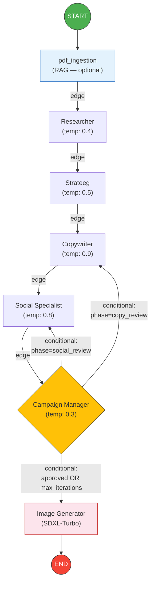
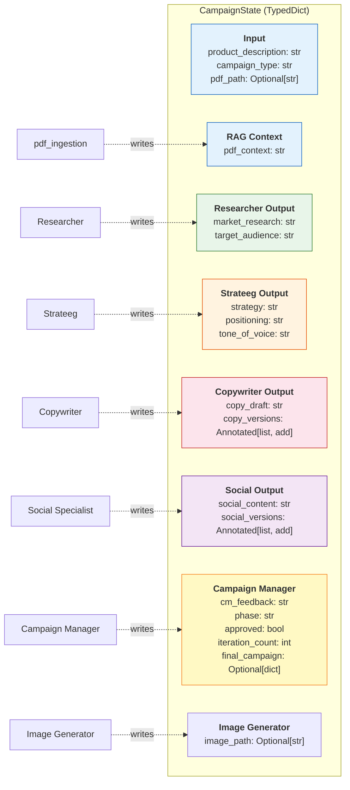
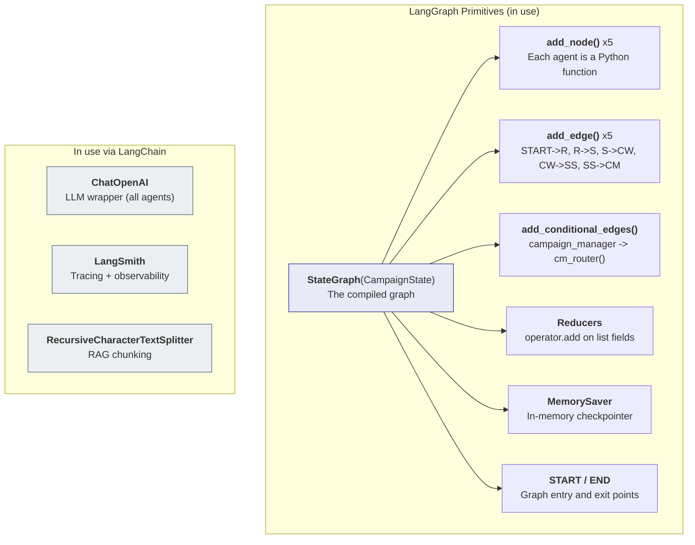

# Architecture — Eva Multi-Agent System

This document describes the full LangGraph architecture for the Eva multi-agent marketing campaign generator.

## 1. Graph Flow

The main pipeline: a PDF ingestion node followed by 5 agents, conditional feedback loops from the Campaign Manager, and a final image generation step.



### How it works

1. **START** triggers the `pdf_ingestion` node — if `pdf_path` is set, it runs RAG and writes `pdf_context`; otherwise it writes an empty string and exits silently
2. Each agent processes sequentially: Researcher -> Strateeg -> Copywriter -> Social Specialist -> Campaign Manager
3. The **Campaign Manager** evaluates all content and decides:
   - **Approve** -> finalize and go to END
   - **Reject copy** -> send feedback back to Copywriter (loop)
   - **Reject social** -> send feedback back to Social Specialist (loop)
   - **Max iterations reached** -> finalize with best available content
4. Maximum 3 feedback iterations to prevent infinite loops

## 2. State Schema

All agents read from and write to a shared `CampaignState` (TypedDict). Each node only returns the fields it writes — LangGraph merges them into the state.



### Reducers

Two fields use `operator.add` as a reducer:
- `copy_versions`: Each copywriter iteration appends its draft to this list (preserves full history)
- `social_versions`: Same pattern for social content iterations

All other fields use the default last-write-wins strategy.

### What each agent reads

| Agent             | Reads from State                                                                                    |
| ----------------- | --------------------------------------------------------------------------------------------------- |
| pdf_ingestion     | `pdf_path`, `campaign_type`                                                                         |
| Researcher        | `product_description`, `campaign_type`, `pdf_context`                                               |
| Strateeg          | `product_description`, `market_research`, `target_audience`                                         |
| Copywriter        | `product_description`, `campaign_type`, `target_audience`, `strategy`, `tone_of_voice`, `cm_feedback` |
| Social Specialist | `product_description`, `campaign_type`, `target_audience`, `strategy`, `copy_draft`, `cm_feedback`  |
| Campaign Manager  | ALL fields (including `campaign_type` for skill selection)                                          |
| Image Generator   | `product_description`, `positioning`, `tone_of_voice`                                               |

## 3. LangGraph Concepts Map

Overview of which LangGraph primitives are used in this project.



### Key Concepts Explained

| Concept | What it does | Where in code |
|---------|-------------|---------------|
| `StateGraph` | Creates a graph with a typed state schema | `graph.py` |
| `add_node(name, fn)` | Registers a Python function as a graph node | `graph.py` |
| `add_edge(a, b)` | Creates a fixed connection from node a to node b | `graph.py` |
| `add_conditional_edges(node, router, map)` | Routes to different nodes based on router function output | `graph.py` |
| `operator.add` reducer | Appends to list instead of overwriting (via `Annotated`) | `state.py` |
| `MemorySaver` | Persists state between steps (in-memory) | `graph.py` |
| `START` / `END` | Special constants for graph entry/exit | `graph.py` |

## 4. Conditional Routing Logic

The Campaign Manager's router function determines where the graph goes next:

```
cm_router(state) -> str:
    IF approved == True           -> "finalize" (END)
    IF iteration_count >= MAX (3) -> "finalize" (END)
    IF phase == "copy_review"     -> "copywriter" (feedback loop)
    IF phase == "social_review"   -> "social_specialist" (feedback loop)
    ELSE                          -> "finalize" (END)
```

This creates two possible feedback loops:
1. **Copy loop**: CM -> Copywriter -> Social Specialist -> CM (copy needs revision)
2. **Social loop**: CM -> Social Specialist -> CM (social content needs revision)

## 5. Dynamic Skill System

Each agent loads its skills at runtime based on `campaign_type` from state. Skills are Markdown files in `src/skills/` injected into the agent's system prompt before the base instruction.

**SKILL_MAP** (`src/skills/skills_config.py`):

| Agent | `product` | `book` |
|-------|-----------|--------|
| Researcher | `research-brief` | `book-context` |
| Copywriter | `copywriting` | `book-copywriting` |
| Social Specialist | `social-media` | `book-social` |
| Campaign Manager | `launch-strategy` | `book-launch-strategy` |

The Strateeg is not in the map — its `content-strategy` + `marketing-psychology` skills apply equally to all campaign types.

**Pattern inside each agent node:**

```python
campaign_type = state.get("campaign_type", "product")
skill_content = get_skills(campaign_type, "researcher")
system_prompt = (skill_content + "\n\n---\n\n" if skill_content else "") + _BASE_PROMPT
```

`get_skills()` falls back to `"product"` for unknown campaign types, so existing callers without `campaign_type` are unaffected.

**Adding a new campaign type** requires only:
1. Add skill Markdown files to `src/skills/`
2. Add an entry to `SKILL_MAP` in `skills_config.py`
3. Pass the new type as `campaign_type` to `run_campaign()`

## 6. FastAPI Backend

The graph is exposed via a FastAPI app (`src/api.py`). Campaigns run asynchronously in a background thread (`asyncio.to_thread`) because `graph.stream()` is synchronous.

```
POST /campaigns          → starts _stream_campaign() in background thread, returns job_id
GET  /campaigns/{id}     → polls in-memory job OR reads campaigns/{id}.json from disk
GET  /campaigns/{id}/stream  → SSE stream of events (EventSource)
GET  /campaigns/{id}/events  → all events (live or from saved _events.json)
GET  /campaigns          → list all saved reports (excludes _events.json files)
GET  /pdfs               → list PDFs in data/
POST /pdfs/upload        → upload PDF to data/
GET  /static/...         → serve campaign images (StaticFiles on campaigns/ dir)
```

**Async flow:**
```
POST /campaigns
  └── asyncio.to_thread(_stream_campaign, job_id, request)
        └── graph.stream(initial_state)
              └── yields {node_name: state_updates} per node
                    └── push() → jobs[job_id]["events"]
                    └── frontend EventSource picks up via /stream
```

## 7. Agent Event Bus

`src/event_bus.py` provides thread-local job tracking so any code running inside a campaign thread can push events without passing `job_id` explicitly.

```python
# In api.py — bind job to thread
set_job(job_id)

# In llm.py — automatically called for every LLM invocation
push(agent_name, "llm_call",     "→ Calling model", {"system_prompt": ..., "user_prompt": ...})
push(agent_name, "llm_response", "← Response",      {"preview": ..., "length": ...})

# In api.py — after each graph.stream() chunk
push(node_name, "node_done", "✓ node completed", {state_fields})
```

**Event types:**

| type | When | Data |
|------|------|------|
| `llm_call` | Before every LLM call | `system_prompt`, `user_prompt`, `model`, `provider` |
| `llm_response` | After every LLM call | `preview` (first 800 chars), `length` |
| `node_done` | After every graph node | node-specific state fields |
| `error` | On exception | `error` message |

Events are streamed live via SSE and saved to `campaigns/{report}_events.json` for later review in the Logs tab.
