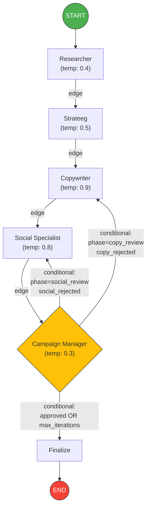
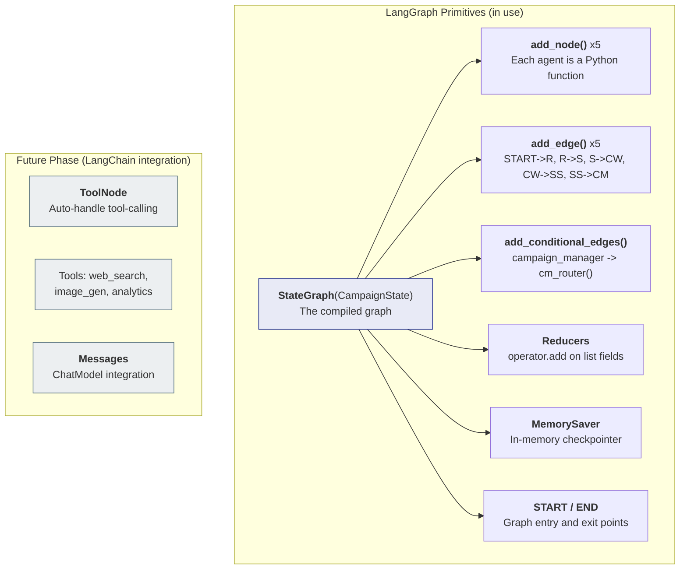

# Architecture — Eva Multi-Agent System

This document describes the full LangGraph architecture for the Eva multi-agent marketing campaign generator.

## 1. Graph Flow

The main pipeline: 5 agents connected via edges, with conditional feedback loops from the Campaign Manager.



### How it works

1. **START** triggers the Researcher node
2. Each agent processes sequentially: Researcher -> Strateeg -> Copywriter -> Social Specialist -> Campaign Manager
3. The **Campaign Manager** evaluates all content and decides:
   - **Approve** -> finalize and go to END
   - **Reject copy** -> send feedback back to Copywriter (loop)
   - **Reject social** -> send feedback back to Social Specialist (loop)
   - **Max iterations reached** -> finalize with best available content
4. Maximum 3 feedback iterations to prevent infinite loops

## 2. State Schema

All agents read from and write to a shared `CampaignState` (TypedDict). Each node only returns the fields it writes — LangGraph merges them into the state.

```mermaid
flowchart LR
    subgraph "CampaignState (TypedDict)"
        direction TB
        INPUT["<b>Input</b>\nproduct_description: str"]
        RESEARCH["<b>Researcher Output</b>\nmarket_research: str\ntarget_audience: str"]
        STRATEGY["<b>Strateeg Output</b>\nstrategy: str\npositioning: str\ntone_of_voice: str"]
        COPY["<b>Copywriter Output</b>\ncopy_draft: str\ncopy_versions: Annotated[list, add]"]
        SOCIAL["<b>Social Output</b>\nsocial_content: str\nsocial_versions: Annotated[list, add]"]
        CONTROL["<b>Campaign Manager</b>\ncm_feedback: str\nphase: str\napproved: bool\niteration_count: int\nfinal_campaign: Optional[dict]"]
    end

    R[Researcher] -.->|writes| RESEARCH
    S[Strateeg] -.->|writes| STRATEGY
    CW[Copywriter] -.->|writes| COPY
    SS[Social Specialist] -.->|writes| SOCIAL
    CM[Campaign Manager] -.->|writes| CONTROL

    style INPUT fill:#E3F2FD,stroke:#1565C0
    style RESEARCH fill:#E8F5E9,stroke:#2E7D32
    style STRATEGY fill:#FFF3E0,stroke:#E65100
    style COPY fill:#FCE4EC,stroke:#C62828
    style SOCIAL fill:#F3E5F5,stroke:#6A1B9A
    style CONTROL fill:#FFF9C4,stroke:#F57F17
```



### Reducers

Two fields use `operator.add` as a reducer:
- `copy_versions`: Each copywriter iteration appends its draft to this list (preserves full history)
- `social_versions`: Same pattern for social content iterations

All other fields use the default last-write-wins strategy.

### What each agent reads

| Agent | Reads from State |
|-------|-----------------|
| Researcher | `product_description` |
| Strateeg | `product_description`, `market_research`, `target_audience` |
| Copywriter | `product_description`, `target_audience`, `strategy`, `tone_of_voice`, `cm_feedback` |
| Social Specialist | `product_description`, `target_audience`, `strategy`, `copy_draft`, `cm_feedback` |
| Campaign Manager | ALL fields |

## 3. LangGraph Concepts Map

Overview of which LangGraph primitives are used in this project.



### Key Concepts Explained

| Concept | What it does | Where in code |
|---------|-------------|---------------|
| `StateGraph` | Creates a graph with a typed state schema | `graph.py` |
| `add_node(name, fn)` | Registers a Python function as a graph node | `graph.py` |
| `add_edge(a, b)` | Creates a fixed connection from node a to node b | `graph.py` |
| `add_conditional_edges(node, router, map)` | Routes to different nodes based on router function output | `graph.py` |
| `operator.add` reducer | Appends to list instead of overwriting (via `Annotated`) | `state.py` |
| `MemorySaver` | Persists state between steps (in-memory) | `graph.py` |
| `START` / `END` | Special constants for graph entry/exit | `graph.py` |

## 4. Conditional Routing Logic

The Campaign Manager's router function determines where the graph goes next:

```
cm_router(state) -> str:
    IF approved == True           -> "finalize" (END)
    IF iteration_count >= MAX (3) -> "finalize" (END)
    IF phase == "copy_review"     -> "copywriter" (feedback loop)
    IF phase == "social_review"   -> "social_specialist" (feedback loop)
    ELSE                          -> "finalize" (END)
```

This creates two possible feedback loops:
1. **Copy loop**: CM -> Copywriter -> Social Specialist -> CM (copy needs revision)
2. **Social loop**: CM -> Social Specialist -> CM (social content needs revision)
