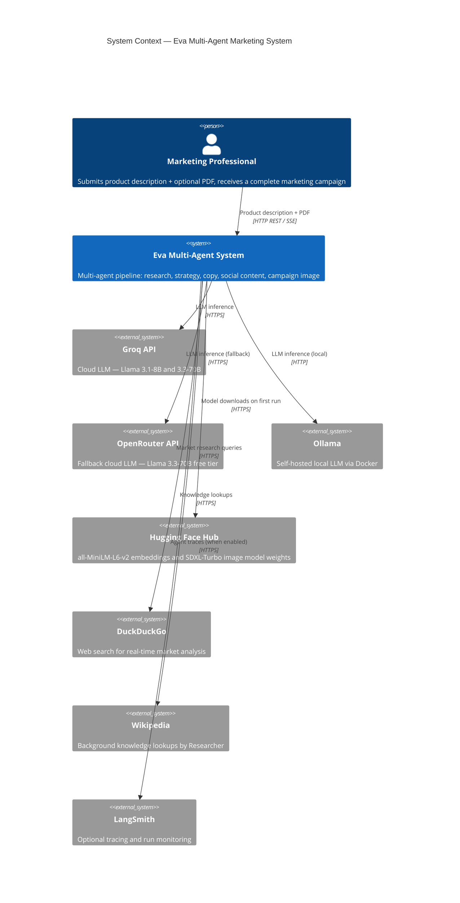
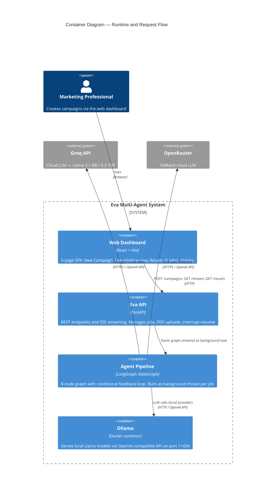
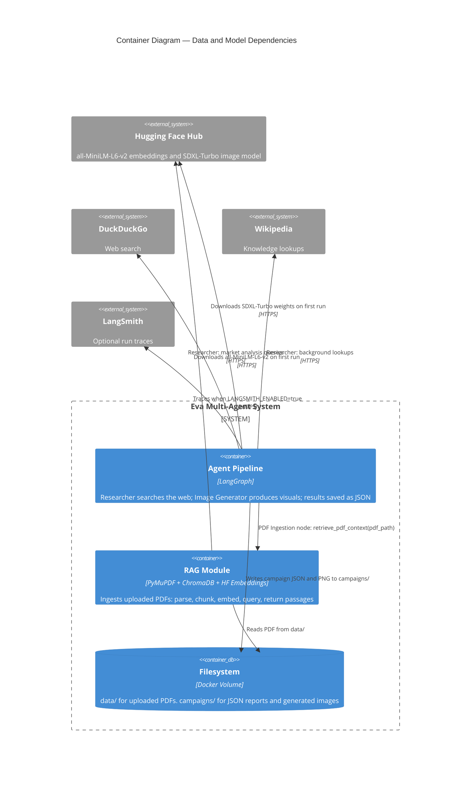
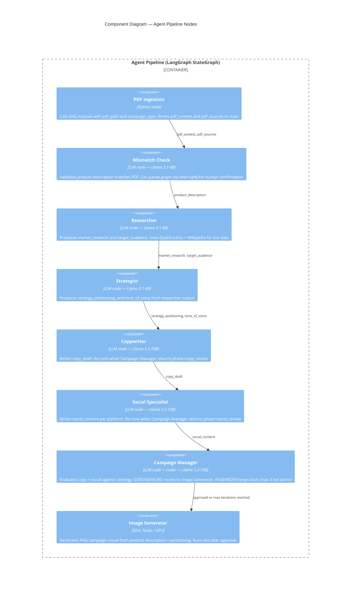
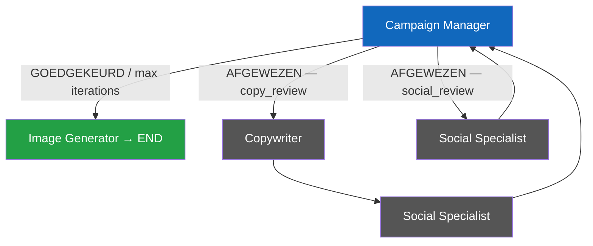
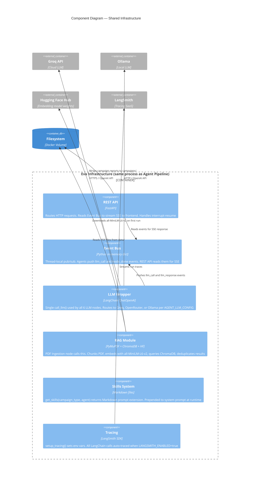

# C4 Architecture Diagrams — Eva Multi-Agent

Three levels of the [C4 model](https://c4model.com) for the Eva multi-agent marketing campaign generator.

---

## Level 1 — System Context

> Who uses Eva and which external systems does it depend on?

---

## Level 2 — Container

Split into two views to keep each diagram readable.

### 2a — Runtime and Request Flow

> How does a campaign request travel through the system?

### 2b — Data and Model Dependencies

> Which container reads and writes what data, and which external services supply models?

---

## Level 3 — Component

Split into two views: the agent pipeline and the shared infrastructure.

### 3a — Agent Pipeline

> What are the 8 agent nodes and what data flows between them?

#### Campaign Manager Routing Logic

> The only node with conditional outgoing edges — shown separately to avoid crossing lines.

### 3b — Infrastructure Components

> How do agents share the LLM wrapper, event bus, RAG module, skills, and tracing?

---

## Key Design Decisions

| Decision | Choice | Reason |
|---|---|---|
| Orchestration | LangGraph StateGraph | Typed state, conditional edges, MemorySaver checkpointing |
| LLM abstraction | LangChain ChatOpenAI + base_url | One interface for Groq, OpenRouter, Ollama — no code changes per provider |
| Per-agent models | 8B for research/strategy, 70B for creative/review | Cost-quality tradeoff per task |
| Embeddings | all-MiniLM-L6-v2, local CPU | Free, ~80 MB, no API key, good retrieval quality |
| Vector store | ChromaDB in-memory | No infra, rebuilt per run, swappable |
| Event streaming | SSE over in-memory Event Bus | Decouples agent logic from transport layer |
| Image generation | SDXL-Turbo, local GPU | No API cost, fp16 for speed, same container |
| Human-in-the-loop | LangGraph interrupt() | Native pause/resume, no custom state machine needed |
